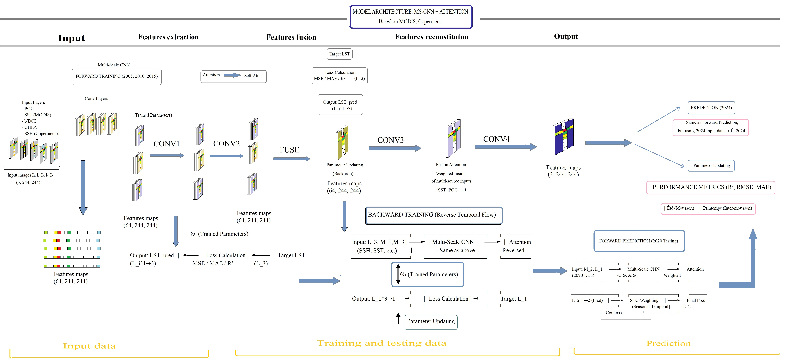
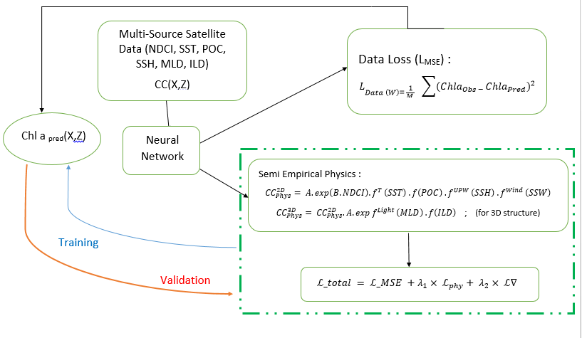

# Physics-Informed Neural Network (PINN) for Remote Sensing (RS) data

It consist on implementation of an uncertainty-aware, multi-modal 3D Convolutional Neural Network with spatial-channel attention to reconstruct high-resolution (30 m) Chlorophyll-a (Chl-a) fields in the Northern Indian Ocean. This project demonstrates how to enforce biophysical oceanographic constraints directly into the loss function of a neural network.
Physics-Informed Neural Network (MS-CNN) (Summarized)
<p align="center">
  
</p>

Physics-Informed Neural Network (PINN) (for Oceanography Prediction)
<p align="center">
  
</p>

## Problem Setup

We model the euphotic-zone Chlorophyll-a concentration, $C(\mathbf{x}, z)$, by fusing multi-sensor surface predictors (Landsat NDCI, MODIS SST/POC, Copernicus SSH) with subsurface physical constraints (Argo MLD, ILD). The semi-empirical Chl-a estimation integrates optical, thermal, light-attenuation, dynamical, and wind-driven processes:


 $$\text{Chl-a}_{\text{phy}}^{\text{2D}} = A \cdot \exp(B \cdot \text{NDCI}) \cdot f^{T}(\text{SST}) \cdot f^{\text{POC}} \cdot f^{\text{upw}}(\text{SSH}) \cdot f^{\text{wind}}(\text{SSW})$$

 $$\text{Chl-a}_{\text{phy}}^{\text{3D}} = \text{Chl-a}_{\text{phy}}^{\text{2D}} \cdot A \cdot \exp(f^{\text{Light}}(\text{MLD})) \cdot f(\text{ILD})$$

Where:
- Optical proxy: $C_{\text{opt}} = A \cdot \exp(B \cdot \text{NDCI})$
- Thermal limitation: $f^T = \exp\left[-\frac{(\text{SST} - T_{\text{opt}})^2}{2\sigma_T^2}\right]$
- Light availability: $f^{\text{Light}} = \frac{1 - \exp(-k_d \cdot \text{MLD})}{k_d \cdot \text{MLD}}, \quad k_d = k_w + k_p \cdot \text{POC}$
- Mesoscale enhancement: $f^{\text{upw}} = 1 + \delta \cdot |\text{SSH}_{\text{anom}}|$
- Wind mixing: $f^{\text{wind}} = 1 + \gamma \cdot |\text{SSW}| \cdot \exp(-\text{MLD}/H_0)$

Instead of training purely on data points, the neural network $NN(\mathbf{X}; \theta)$ minimizes a composite loss function:
1. **Data Loss ($L_{\text{MSE}}$)**: Minimizes mean squared error against interpolated in-situ Argo fluorescence profiles and satellite-derived surface Chl-a.
2. **Physics Loss ($L_{\text{phy}}$)**: Enforces biophysical constraints: (i) non-negative Chl-a predictions, (ii) upper bound on Chl-a/POC ratio ($\alpha = 0.3$) to prevent overestimation in turbid Case-II waters, and (iii) negative SST-Chl-a coupling in oligotrophic stratified zones. The total loss is $L_{\text{total}} = L_{\text{MSE}} + \lambda L_{\text{phy}}$ ($\lambda = 0.2$).

## Usage

Run the standalone training script to reconstruct daily 30m 3D Chl-a fields with Monte Carlo dropout uncertainty quantification:

```bash
python nio_pinn_train.py
